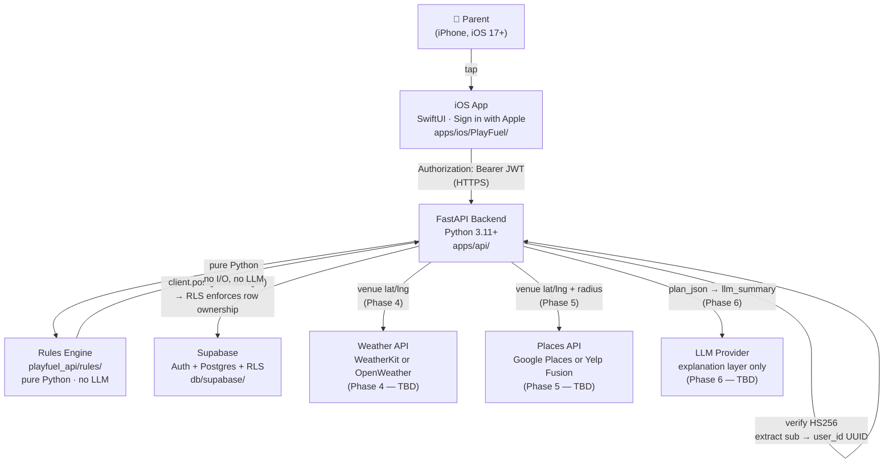

# PlayFuel — Architecture

> New-engineer mental model. 10-minute read.  
> Audience: someone joining the team and needing the full picture before touching code.

---

## System Diagram



**JWT flow (end-to-end):**

1. Parent taps Sign in with Apple on iPhone
2. Apple returns identity token → Supabase Auth (`/auth/v1/token?grant_type=id_token`)
3. Supabase issues a Supabase access token (HS256 JWT, `aud: "authenticated"`, `sub: <UUID>`)
4. iOS sends `Authorization: Bearer <access_token>` on every API request
5. `auth.py` verifies signature with `SUPABASE_JWT_SECRET`; checks `aud="authenticated"`;
   extracts `sub` as `UUID` user_id
6. That same JWT is forwarded to supabase-py: `client.postgrest.auth(jwt)` →
   Postgres RLS enforces row ownership automatically

---

## Components

### iOS App (`apps/ios/PlayFuel/`)

- **SwiftUI + Sign in with Apple, iOS 17+, zero external dependencies, zero networking**
  (in Phase 1; Phase 3 adds real API client)
- iOS models mirror the API's `ScenarioPlan` / `Plan` shapes exactly (§G of
  `RULES_CONSTANTS_V1.md`) — `JSONDecoder()` works with no custom key strategy because
  the API already emits camelCase
- **`FakeData.swift` is the Phase 3 swap point**: replace it with a real API client and
  no View files change
- `HardCodedStrings.swift` owns all verbatim disclaimer and heat-emergency text —
  never re-typed in View code
- `EmergencyBanner.swift` renders at the top of `TournamentDashboardView` whenever
  `extremeHeatRisk = true`

### Backend API (`apps/api/`)

- **FastAPI + Pydantic v2, Python 3.11+**
- JWT-verified per request (see `auth.py` — `HTTPBearer(auto_error=False)` with explicit
  401 guard; see [Auth Model](#auth-model) below)
- **RLS-only ownership**: no `WHERE user_id = ?` or `eq("user_id", ...)` filters in any
  route handler — Postgres RLS does all ownership enforcement
- **camelCase JSON output** via `alias_generator=to_camel` in `models/api.py`;
  `response_model_by_alias=True` on every plan endpoint;
  `model.model_dump(by_alias=True, mode="json")` when persisting JSONB
- 18 endpoints across `health`, `player_profiles`, `tournaments`, `matches`, `plans` routers
  (see `apps/api/README.md` for full inventory)

### Rules Engine (`apps/api/src/playfuel_api/rules/`)

- **Pure Python, fully deterministic, no LLM calls, no I/O**
- `generate_match_scenarios(match, next_match)` → `list[ScenarioPlan]` is the main entrypoint
- Constants frozen in `rules/constants.py`; `RULES_CONSTANTS_VERSION = "1.0.0"` logged on
  startup and returned by `/healthz`
- Hard-coded safety strings (`OVERRUN_MESSAGE`, `HEAT_EMERGENCY_TEXT`, `BAG_FOOD_FALLBACK`)
  live in `rules/hard_coded_strings.py` — never derived or modified at runtime
- `classify_weather(temp_f, humidity_pct, condition)` → 7-flag dict including `extreme_heat_risk`
- `food_bucket_for(gap_min)` / `pickup_bucket_for(gap_min)` — half-open `[a, b)` interval lookups

### Database (`db/supabase/`)

- **Supabase Postgres + Row-Level Security**
- **9 public tables:** `users`, `player_profiles`, `tournaments`, `matches`,
  `match_scenarios`, `weather_snapshots`, `food_options`, `plans`, `feedback`
- **6 Postgres enum types** (byte-for-byte mirrored in Python `models/enums.py`)
- `auth.users` cascade-deletes all `public.*` rows — deleting a user wipes everything
  in one transaction (required by account-deletion UX, per Apple Guideline 5.1.1(v))
- `plans.plan_json` (JSONB) stores the rules-engine output; `plans.llm_summary` (Phase 6)
  stores the LLM explanation text; all FKs use `ON DELETE CASCADE`
- `updated_at` is managed by a shared `set_updated_at()` trigger function (not duplicated)

### Weather (Phase 4 — pending)

- `weather_snapshots` table and `classify_weather()` function are already implemented;
  the live API client is not
- Phase 4 (Task #7) integrates WeatherKit or OpenWeather — **TBD per OQ-D**

---

## Data Flow: Generate-Plan Request

```
1.  Parent taps "Generate Plan" in iOS app
2.  iOS → POST /v1/tournaments/{tid}/plans/generate
          Authorization: Bearer <jwt>
3.  auth.py: verify HS256 signature → extract UUID from sub claim
4.  db.py: create per-request supabase-py client → client.postgrest.auth(jwt)
5.  routes/plans.py loads:
      a. First match for tournament (by display_order)
      b. Second match (if any) as next_match reference
      c. Weather snapshot for tournament (if present)
6.  rules/scenarios.py:
      generate_match_scenarios(match, next_match)
      → 3 ScenarioPlan objects [short / normal / long]
7.  rules/plan.py:
      build_plan_envelope(scenarios, weather)
      derive_schedule_confidence(scenarios)
      → Plan object
8.  Serialise: plan.model_dump(by_alias=True, mode="json") → plan_json JSONB
9.  INSERT plans row via RLS-scoped supabase-py client
10. Return Plan (camelCase) to iOS
11. iOS renders:
      ScenarioCardView × 3
      WeatherCardView (flags + adjustments)
      FoodCardView (options + bag fallback)
      EmergencyBanner if extreme_heat_risk = true
```

---

## Auth Model

```
Apple Sign-In (iPhone)
  └─▶ Apple identity token
        └─▶ Supabase Auth (POST /auth/v1/token?grant_type=id_token)
              └─▶ Supabase access token
                    alg: HS256 · aud: "authenticated" · sub: <Supabase UUID>
                    └─▶ iOS: Authorization: Bearer <token>
                          └─▶ FastAPI auth.py
                                bearer_scheme = HTTPBearer(auto_error=False)
                                ├─▶ creds is None → HTTP 401 (static message)
                                ├─▶ jwt.ExpiredSignatureError → HTTP 401 "Token has expired"
                                ├─▶ jwt.InvalidTokenError → HTTP 401 "Invalid token"
                                └─▶ valid → UUID(claims["sub"])
                                      └─▶ db.py: client.postgrest.auth(jwt)
                                            └─▶ Postgres RLS: auth.uid() = user_id
```

**Critical implementation note:** `HTTPBearer(auto_error=False)` is used with an explicit
`if creds is None` guard that raises HTTP 401. FastAPI's default `HTTPBearer(auto_error=True)`
raises HTTP 403 when the `Authorization` header is absent. That was standardized to 401 in
Task #5 closeout for HTTP-spec compliance and iOS consistency. The smoke test asserts 401 for
missing credentials.

**Algorithm allow-list:** `jwt.decode(..., algorithms=["HS256"])` prevents algorithm-confusion
attacks (e.g., `alg: none` or RS256/HS256 switching).

**RLS, not backend filters:** Route handlers never add `WHERE user_id = ?`. The JWT is
threaded to supabase-py via `client.postgrest.auth(jwt)` and Postgres RLS does ownership.
Both "not found" and "not yours" cases return 404 (empty RLS result) — no existence disclosure.

---

## Rules Engine Architecture

| Invariant | Detail |
|---|---|
| **Half-open intervals `[a, b)`** | Food buckets: `[0,45)=bag_only` · `[45,90)=portable` · `[90,150)=quick_pickup` · `[150,∞)=light_meal`. Pickup: `[0,60)=bring_portable` · `[60,120)=pickup_during_match` · `[120,∞)=wait_until_end`. **`gap=120 → quick_pickup` (not `light_meal`).** |
| **`gap_status` enum** | `overrun` ONLY when `gap < 0`. `tight` for `[0, 30)`. `ok` for `≥ 30`. `no_next_match` when next match is `None`. Gap = 0 → `tight`, NOT `overrun`. |
| **Overrun clamps** | `overrun` → `food=bag_only`, `pickup=bring_portable`, `rewarm_up=null`. Always HTTP 200 with `OVERRUN_MESSAGE`. No error status — degraded plan, not a server error. |
| **`extreme_heat_risk`** | `very_hot OR (hot AND humid)` per §E.2. 88°F → `hot`; 72% humidity → `humid` → `extreme_heat_risk = true`. `very_hot` threshold is 90°F (88°F does NOT set `very_hot`). |
| **Constants versioned** | `RULES_CONSTANTS_VERSION = "1.0.0"` in `rules/constants.py`. Logged on startup; returned by `GET /healthz`. |
| **Hard-coded strings** | `OVERRUN_MESSAGE`, `HEAT_EMERGENCY_TEXT`, `BAG_FOOD_FALLBACK` compiled into `rules/hard_coded_strings.py`. Never re-derived, never LLM-generated. |
| **No LLM in engine** | `generate_match_scenarios()` is pure Python. Phase 6 adds `llm_summary`; it never modifies `plan_json`. |

**Gap formula:**
```
gap_minutes = estimated_next_match_start − (scheduled_match_start + scenario_duration_min)
```

**Scenario durations (hardcoded in v1):**
- `short = 75 min` · `normal = 120 min` · `long = 180 min`

**Dallas 9 AM / 1 PM worked example:**

| Scenario | Duration | Match 1 end | Gap | Food bucket | Pickup bucket |
|---|---|---|---|---|---|
| Short | 75 min | 10:15 AM | 165 min | `light_meal` | `wait_until_end` |
| Normal | 120 min | 11:00 AM | 120 min | `quick_pickup` | `wait_until_end` |
| Long | 180 min | 12:00 PM | 60 min | `portable` | `pickup_during_match` |

---

## Phase 6 LLM Layer (Deferred)

The rules engine fills `plans.plan_json` with a complete structured plan (camelCase JSONB).
Phase 6 (Task #9) adds a single LLM call per plan generation:

- **Input:** `plan_json` (stripped of direct PII per `PRIVACY_V1.md §6.4`)
- **Output:** `plans.llm_summary` — parent-friendly explanation prose
- **Constraints:** LLM must not invent restaurants, menu items, weather facts, schedule
  logic, or hydration quantities. System prompt requirements are in `SAFETY_DISCLAIMERS.md §E`.
- **v1 is fully deterministic.** No LLM is in any critical path today.

---

## Testing Posture

| Layer | Test file | Coverage |
|---|---|---|
| Bucket boundaries | `test_buckets.py` | 13 named boundary tests incl. `test_gap_120_is_quick_pickup` |
| Weather flags | `test_weather.py` | Parametrized: 65°F/40%, 88°F/72%, 92°F/30%, 88°F/40%, 50°F, rain |
| Scenario acceptance | `test_scenarios.py` | 5 SCENARIO_ACCEPTANCE cases; Scenario 5 (rain delay) `xfail(reason="OQ-F deferred to Phase 4")` |
| Route smoke | `test_routes_smoke.py` | `/healthz` → 200; no token → 401; mocked auth → 200 |
| iOS | — | No automated tests in Phase 1; manual smoke via Xcode simulator |

All tests use `pytest ≥ 8.0`. Run: `cd apps/api && python3.12 -m pytest src/playfuel_api/tests/ -v`

---

## Open Questions

Open questions are tagged inline in code as `[DRAFT — OQ-X]` comments and listed in their
owning spec. Current live OQs:

| OQ | Short description | Blocking phase |
|---|---|---|
| OQ-A | Hydration quantities (oz) for each trigger event | Phase 6 |
| OQ-B | Restaurant order templates for `sandwich_shop`, `grocery_prepared`, `breakfast_cafe` | Phase 5 |
| OQ-C | Pre-match / warm-up offset values (T−3h wake, T−2.5h meal, T−30m warm-up, etc.) | Phase 3 cutover |
| OQ-D | `extreme_heat_risk` flag name; `very_hot`-specific plan adjustments | Phase 4 |
| OQ-E | `tight` gap threshold — currently 30 min (Engineering proposal, not confirmed) | Phase 3 cutover |
| OQ-F | Rain delay handling when schedule is uncertain | Phase 4 |
| OQ-06 | COPPA legal review — pre-launch blocker | Legal |
| OQ-11 | Heat-illness emergency wording — attorney review required — pre-launch blocker | Legal |
| OQ-PRIV-1..7 | Privacy sub-questions for legal counsel | See `PRIVACY_V1.md §11` |
| OQ-QA-2 | Unused `PlayerProfileRow` import in `routes/player_profiles.py` | Low (lint) |

Full OQ registry: `RULES_CONSTANTS_V1.md §I`, `PRIVACY_V1.md §11`.
Do not silently resolve OQs — see `CONTRIBUTING.md` for the OQ system.
